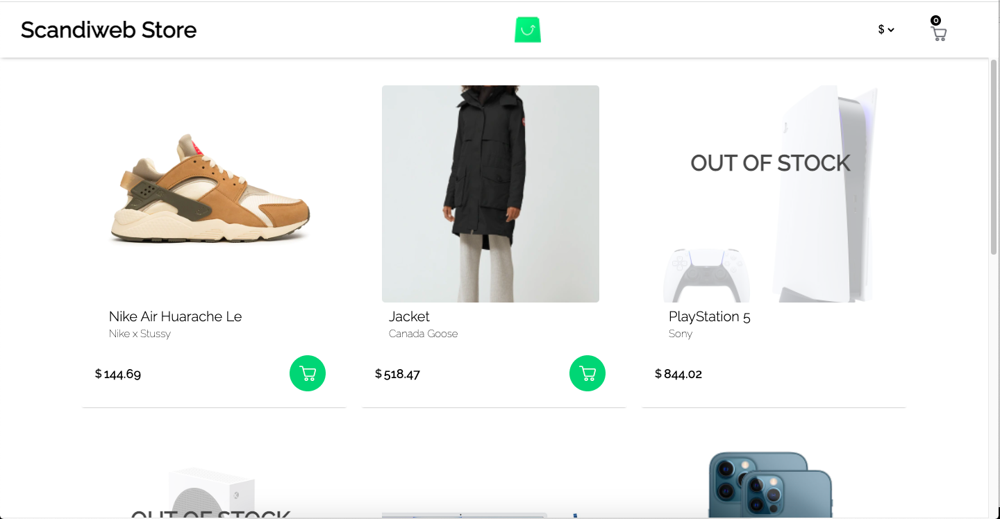

# Welcome to the React Junior Test from Scandiweb!

## 📱 Screenshot:

## :rocket: About this project:

### This is a Junior challenge made by ScandiWeb:

#### You can find all the information here: https://www.notion.so/Entry-React-developer-TEST-39f601f8aa3f48ac88c4a8fefda304c1

#### Required: React (class components) and GraphQl. The endpoint was provided by Scandi.
#### All the requirements you can find in the link above.

## :books: Technology used to make this app:

## Javascryt, React, GraphQl and Cypress for integration tests.

